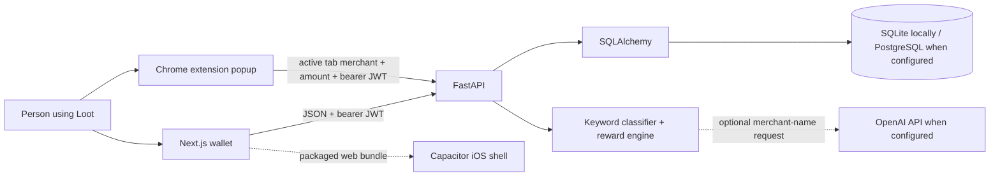

# Loot Wallet project guide

Loot Wallet is a smart-wallet concept: help someone choose the most rewarding card they already own for a purchase. This guide describes the product as it exists in this repository, how its parts work, how to run it, and where the current prototype stops.

> **Product boundary:** Loot's Chrome extension identifies the active shopping site and ranks eligible saved cards before checkout. It does not take over Apple Wallet, read the NFC reader, choose a payment card in Apple Pay, connect to issuer systems, or move money. “Smart routing” means ranking the cards in a user’s Loot account for a merchant and amount.

## Contents

- [At a glance](#at-a-glance)
- [Run the app](#run-the-app)
- [The product flow](#the-product-flow)
- [Application architecture](#application-architecture)
- [Frontend behavior](#frontend-behavior)
- [Backend behavior](#backend-behavior)
- [Reward recommendation logic](#reward-recommendation-logic)
- [Data model](#data-model)
- [HTTP API reference](#http-api-reference)
- [Configuration](#configuration)
- [Privacy and security](#privacy-and-security)
- [Build and iOS packaging](#build-and-ios-packaging)
- [Known limits and next product steps](#known-limits-and-next-product-steps)
- [Troubleshooting](#troubleshooting)
- [Repository map](#repository-map)

## At a glance

| Area | Implementation |
|---|---|
| Product name | Loot Wallet |
| Web client | Next.js App Router, React, TypeScript |
| Browser companion | Chrome Manifest V3 popup extension |
| API | FastAPI, Python |
| Persistence | SQLAlchemy; SQLite by default, PostgreSQL can be configured |
| Authentication | bcrypt password hashes and signed JWT bearer tokens |
| Catalog | Seeded card issuers, products, and reward rules, currently oriented around India |
| Merchant category | Local keyword matching by default; optional OpenAI classification with fallback |
| Purchase capture | Manual form or user-pasted bank SMS alert |
| Recommendation | Compare estimated rewards across a user’s active cards |
| Native packaging | Capacitor iOS wrapper; build and signing require macOS and Xcode |

The backend and frontend are separate processes. The browser calls the API directly; the API owns account data, reward calculations, catalog queries, and analytics.



The dotted OpenAI path is optional. Without an API key, classification stays local. The extension reads the active tab's URL and title to derive a merchant label; it does not scrape checkout fields. The iOS shell packages the web client; it does not itself provide payment-network or NFC routing.

## Run the app

### Local requirements

- Python 3.10 or newer.
- Node.js 22 or newer.
- The checked-in Python requirements and the frontend lockfile.
- No external database is needed for a local run; SQLite is the default.

### Start the API

From the repository root, open a terminal and run:

```powershell
cd backend
python -m venv .venv
.venv\Scripts\Activate.ps1
pip install -r requirements.txt
Copy-Item .env.example .env
uvicorn app.main:app --reload --host 127.0.0.1 --port 8000
```

If `backend/.venv` already exists, activate it and skip creation/install. On startup, the API creates tables when `CREATE_TABLES_ON_STARTUP=true` and runs the idempotent catalog seeder. The default SQLite file is `backend/loot.db` because the working directory is `backend`.

### Start the web client

In a second terminal:

```powershell
cd frontend
npm ci
npm run dev
```

Open [http://localhost:3000](http://localhost:3000). The API’s interactive schema is at [http://127.0.0.1:8000/docs](http://127.0.0.1:8000/docs); its health endpoint is [http://127.0.0.1:8000/health](http://127.0.0.1:8000/health).

Use the sign-in view to create an account. Add at least one catalog card before asking for a recommendation. Record a purchase to populate the activity and insights views. Stop either development server with **Ctrl+C** in its terminal.

### API URL

The client defaults to `http://localhost:8000`. To point it at another API, create `frontend/.env.local`:

```text
NEXT_PUBLIC_API_URL=https://api.example.com
```

The value is compiled into the client bundle, so restart the dev server or rebuild after changing it. For an iPhone, `localhost` means the phone itself; use an HTTPS API hostname reachable from that device.

## The product flow

1. **Create an account or sign in.** The API returns a signed access token and the user profile. The client stores the token in browser local storage.
2. **Add existing cards.** Browse the catalog and save card products by name. The wallet asks for no card number, expiry date, or security code. For Apple Pay recommendations in India, the wallet only offers Axis Bank Visa and Mastercard products in the catalog.
3. **Ask what to use.** Open a shopping site and click the Loot Chrome extension. It reads the current tab's hostname and title, identifies the merchant, then asks the API to rank eligible cards. It starts with a ₹1,000 example amount; the user can change that amount in the popup.
4. **Record purchases.** A user can enter a purchase manually, select the card used, or paste a supported bank SMS alert. Loot estimates rewards earned and compares the saved card with the best active card.
5. **Review activity and insights.** Saved transactions feed the dashboard, category totals, monthly report, and card utilization views.

The “default” card is a user preference. Apple Pay India recommendations include only active Axis Bank Visa or Mastercard credit cards. Loot shows a suggestion before checkout; the user still chooses and confirms a card in Apple Pay.

## Application architecture

### Request and persistence path

1. The Next.js client calls a typed helper in `frontend/lib/api.ts`.
2. The helper adds JSON headers and, for protected operations, `Authorization: Bearer <token>`.
3. FastAPI validates the request with Pydantic schemas and obtains a SQLAlchemy session through `get_db`.
4. Protected routers resolve the user from the JWT. Queries for personal cards and transactions filter by that user ID.
5. The router, classifier, reward engine, or analytics query performs the operation and serializes the result through its response schema.

The API enables CORS for the comma-separated origins in `CORS_ORIGINS`. SQLite uses `check_same_thread=False`; the SQLAlchemy engine enables `pool_pre_ping`.

### Startup lifecycle

`backend/app/main.py` creates a FastAPI app, installs CORS, includes the auth, cards, catalog, transactions, routing, and analytics routers, and exposes `/health`. At startup it conditionally runs `Base.metadata.create_all`; it also attempts to seed the catalog. Seed errors are logged as warnings so the server can still start. This is convenient for development; production schema changes should use reviewed migrations instead of automatic table creation.

### Frontend state and API session

The app is implemented as a responsive client-side wallet experience in `frontend/app/page.tsx`. On boot it restores the theme and token, then loads the profile, cards, transaction page, category totals, current-month report, card utilization, and dashboard summary. If the saved token is invalid or expired, the app clears it and asks the user to sign in again. Signing out removes the token.

Storage keys currently used by the web client are `loot-access-token` and `loot-theme`. They are browser local-storage values, not server-side sessions or `HttpOnly` cookies.

## Frontend behavior

| View | What it shows or does |
|---|---|
| Sign in / register | Create an account with username, email, and password, or authenticate using username or email and password. |
| Home | Greeting, reward totals, spend/missed-reward metrics, recent purchases, category summary, and an Apple Pay setup shortcut. |
| Activity | Account purchase history and purchase-entry actions. The API supports paginated lists and category/card filters. |
| Wallet | Active cards, catalog search for eligible Axis Bank Visa/Mastercard products, adding by card name, setting a default, renaming, and removing. |
| Insights | Spending by category, current-month totals, missed-reward estimates, and card utilization based on saved purchases. |
| Profile | Account details, light/dark theme selection, and sign out. |
| Add purchase sheet | Manual merchant, amount, optional card/category details and a separate pasted-SMS import path. |
| Chrome extension | Reads the active site's URL and title, suggests the best eligible card, shows other saved options, and lets the user adjust the sample amount. |

The layout is mobile-first and uses a bottom navigation bar on the main wallet views. The interface can be used in a desktop browser too. A marketing landing page, beta signup flow, and waitlist are not the current app experience.

## Backend behavior

### Authentication

- Registration trims/lowercases email and checks that email and username are unique.
- Login accepts either username or email.
- Passwords are hashed with bcrypt through Passlib; plaintext passwords are not stored.
- Tokens use HS256 and carry the user ID as `sub`, the username, and an expiry. The default expiry is 1,440 minutes (24 hours).
- Protected endpoints use the shared `get_current_user` dependency. Missing, invalid, or expired credentials return HTTP 401.

### Card catalog and user wallet

The catalog separates shared master data (issuer, product, reward rules) from a user’s `UserCard` record. Catalog endpoints are public. Adding a card verifies that the catalog product exists. Re-adding an inactive matching card restores its record, preserving old transaction references. Removing a card is a soft delete (`is_active=false`); historical transaction references remain. Setting a card as default clears the prior default for that account. The current wallet UI adds a card by catalog name only.

The database retains an optional legacy last-four field for older records and SMS matching. The current wallet API no longer accepts or returns it, and the current UI saves a catalog card by product name only. Full PAN, CVV, expiry, and issuer credentials are not collected by this flow.

### Purchases

Manual purchase creation validates that the selected card belongs to the signed-in user. It classifies the merchant only when a category was not supplied, records/looks up a normalized merchant, calculates estimated reward on the selected card when present, ranks the wallet, and saves the resulting recommendation and estimated missed value on the transaction.

SMS import parses the submitted text in memory, rejects unparseable alerts, credits/refunds, and nonpositive amounts, then may match an active legacy user card by last four digits. It creates a normal transaction with `source="sms"`; the raw SMS body is not a database field and is not retained after parsing. If no card matches, the transaction is still imported without `card_id`.

### Merchant categories

Recognized categories are `dining`, `grocery`, `fuel`, `travel`, `online`, `utilities`, `entertainment`, `healthcare`, `education`, `insurance`, `government`, `rent`, `international`, `department_store`, and `other`.

Without `OPENAI_API_KEY`, local substring keyword rules classify common Indian merchants and return `other` when no keyword matches. With a key, the server sends the merchant name to the configured OpenAI chat-completions model; unexpected output or provider errors fall back to the local classifier. The classifier is synchronous on the transaction/recommendation request path and has a 10-second HTTP timeout. The current international category is present in the taxonomy, but currency conversion or a reliable origin detector is not implemented.

### Analytics

- **Summary:** all-time transaction count and reward totals, active card count, and a duplicate `money_left_on_table` value equal to all-time missed rewards.
- **Spending by category:** sums transactions from a rolling cutoff of `months × 30 days`; the allowed range is 1–24.
- **Card utilization:** for each active card, reports use count, spend, earned estimate, and how often it was optimal. Utilization is the number of transactions where that card was both used and marked optimal divided by the number where it was marked optimal.
- **Monthly report:** uses a calendar month in UTC, supplied as `YYYY-MM`, and returns spend, earned/missed estimate totals, and the top spend category. `worst_card_losses` and `best_card_to_add` are schema fields but the current handler does not populate them.

Analytics summarize the purchases recorded in Loot; they do not reconcile with issuer statements or prove that a reward actually posted.

## Reward recommendation logic

The core implementation lives in `backend/app/services/routing_engine.py`.

1. Classify the merchant to one spending category.
2. Load the current user’s active cards and each card product.
3. For each card, find reward rules for that product/category whose optional start/end dates include the current UTC time.
4. Estimate one value for each matching rule and choose that product’s highest-valued rule. If none applies, use the product’s base rate.
5. Sort cards by estimated value descending. Return the first, up to three alternatives, and the difference between the best and worst card values.

For a cashback rule, the estimate is `purchase amount × cashback percentage ÷ 100`. For a multiplier rule, the estimate is `purchase amount × rule multiplier × base earn rate × point value`. A base-only estimate is `purchase amount × base earn rate × point value`. The catalog’s `point_value` is an assumed rupee value used to compare points with cashback; it is not a redemption guarantee.

When a rule has a minimum spend and the purchase is below it, the engine falls back to the base estimate. It clamps each calculated transaction estimate to any configured monthly/quarterly cap values.

### Important calculation limits

- The engine does **not** accumulate a user’s prior monthly or quarterly rewards against cap usage. A cap currently acts as a per-transaction maximum, despite the cap field names.
- `conditions` on reward rules are stored but not evaluated. Merchant exclusions, MCC details, offer enrollment, payment-channel restrictions, and issuer-specific eligibility are not modeled by the ranker.
- Annual fee, lounge access, insurance, sign-up bonus, user spend thresholds, and points expiry do not affect a recommendation.
- The request currency is accepted, but the ranker assumes the configured reward values and amounts are comparable; it does not convert foreign currencies.
- `apple_pay_india=true` restricts ranking to Axis Bank Visa and Mastercard products. This mirrors Apple's current India bank list; issuer/card eligibility can change and should be rechecked with Apple and the issuer.
- A supplied category is accepted as given for a saved transaction. Category quality affects both its estimate and analytics grouping.
- If a transaction has no selected card, its recorded earned value starts at zero; if an optimal card is found, the difference may be counted as missed. This measures opportunity in the ledger, not a confirmed loss.
- No eligible cards produces a placeholder recommendation object with ID `0`; the Chrome popup translates that into an “add an eligible card” empty state.

All calculations are estimates based on the current local catalog. Issuer terms can change, and the seed catalog is starter data rather than a live issuer feed.

## Data model

All monetary SQLAlchemy columns use decimal/numeric types to avoid binary floating-point storage for amounts.

| Entity | Purpose and links |
|---|---|
| `CardIssuer` | Shared issuer name, slug, logo, and country. One issuer has many products. |
| `CardProduct` | Shared card product: issuer, network, tier, fee, reward currency, base rate, point value, benefits, country, active flag. One product has reward rules and may be referenced by many user cards. |
| `RewardRule` | Product/category earning rule, earn type/rate, optional caps and minimum spend, validity dates, and conditions JSON. |
| `Merchant` | Normalized merchant name, display name, category/subcategory, optional MCC/logo, and metadata. Transactions may link to it. |
| `User` | Unique email/username, password hash, display name, country, onboarding flag, and creation timestamp. Owns cards and transactions. |
| `UserCard` | User-to-product wallet link with nickname, optional legacy last four, default/active state, and add timestamp. |
| `Transaction` | User purchase facts plus used card, merchant, category, source, timestamp, earned estimate, best-card estimate, and missed-reward estimate. |
| `Subscription` | A subscription-shaped model exists in the ORM, but there is currently no subscription router, workflow, or screen. It should not be read as a shipped feature. |

Important foreign-key behavior: user deletion cascades to that user’s cards and transactions; deleting a user card can set transaction card references to null; removing a card in the UI is a soft delete and avoids deleting it from history.

## HTTP API reference

Base URL in local development: `http://localhost:8000`. JSON request examples below omit routine response fields. Unless marked **public**, include `Authorization: Bearer <access_token>`. The full live schema is generated at `/docs`.

### Health, identity, and catalog

| Method and path | Access | Purpose / key inputs |
|---|---|---|
| `GET /health` | Public | Liveness response with status, configured app name, and environment. |
| `POST /auth/register` | Public | JSON `{ "username": "maya", "email": "maya@example.com", "password": "..." }`; returns user and access token (201). |
| `POST /auth/login` | Public | JSON `{ "username": "maya-or-email@example.com", "password": "..." }`; returns user and access token. |
| `GET /auth/me` | Protected | Return the token’s user profile. |
| `GET /catalog/issuers?country=IN` | Public | List issuers for a country. |
| `GET /catalog/cards?country=IN&issuer_id=1&network=visa&tier=gold` | Public | List active products; filters are optional. |
| `GET /catalog/cards/{product_id}` | Public | One product with issuer and reward rules. |
| `GET /catalog/categories` | Public | Return recognized category strings. |

### User cards

| Method and path | Purpose / key inputs |
|---|---|
| `GET /cards/` | List the signed-in user’s active cards with product/issuer detail. |
| `POST /cards/` | JSON `{ "card_product_id": 12, "nickname": "Axis card", "is_default": true }`. `nickname` and `is_default` are optional. Returns 201. |
| `PATCH /cards/{card_id}?nickname=Travel%20card&is_default=true` | Update nickname and/or default state. Parameters are query parameters, not a JSON body. |
| `DELETE /cards/{card_id}` | Soft-deactivate the user card; returns 204. |

### Transactions

| Method and path | Purpose / key inputs |
|---|---|
| `POST /transactions/` | Create a purchase. Example JSON: `{ "merchant_raw": "Swiggy", "amount": 850, "card_id": 3, "currency": "INR" }`. `amount` must be positive; card must belong to the current user. `category`, `source`, and `transacted_at` can also be supplied. Returns 201. |
| `POST /transactions/sms` | JSON `{ "sms_body": "...bank alert text..." }`. Parses amount, merchant, optional legacy last four, and optional date. Refund/credit alerts are rejected. Returns 201. |
| `GET /transactions/?page=1&page_size=20&category=dining&card_id=3` | Paginated current-user purchases; `page_size` is 1–100; filters are optional. |
| `GET /transactions/{txn_id}` | One owned transaction with used-card, optimal-card, and merchant details. |

### Routing and analytics

| Method and path | Purpose / key inputs |
|---|---|
| `POST /route/` | JSON `{ "merchant_name": "Zomato", "amount": 850, "currency": "INR", "apple_pay_india": true }`; when `apple_pay_india` is true, ranks only Axis Bank Visa/Mastercard cards. Requires a token. |
| `GET /analytics/summary` | All-time dashboard totals and active-card count. |
| `GET /analytics/spending-by-category?months=1` | Category aggregates for 1–24 rolling 30-day months. |
| `GET /analytics/card-utilization?months=1` | Card usage/optimality for 1–24 rolling 30-day months. |
| `GET /analytics/monthly-report?month=2026-10` | Calendar-month report for a `YYYY-MM` UTC month. |

### Example recommendation request

```http
POST /route/
Authorization: Bearer <access_token>
Content-Type: application/json

{
  "merchant_name": "Zomato",
  "amount": 850,
  "currency": "INR",
  "apple_pay_india": true
}
```

The response’s `recommended.reward_value` is an estimate in the catalog’s comparison currency (currently treated as INR). `alternatives` is ranked after the top card and contains no more than three entries.

## Configuration

Backend settings load from environment variables and `backend/.env` (relative to the backend process working directory). See [`backend/.env.example`](../backend/.env.example).

| Variable | Default / behavior |
|---|---|
| `APP_NAME` | `Loot Wallet`; also appears in health and OpenAPI metadata. |
| `ENVIRONMENT` | `development`. |
| `DATABASE_URL` | `sqlite:///./loot.db`; use a SQLAlchemy PostgreSQL URL for a shared database. |
| `JWT_SECRET` | Development placeholder in local configuration; use a long, random secret outside local development. |
| `ACCESS_TOKEN_EXPIRE_MINUTES` | `1440` (24 hours). |
| `CORS_ORIGINS` | Comma-separated allowlist; local defaults include localhost/127.0.0.1 port 3000 and `capacitor://localhost`. |
| `OPENAI_API_KEY` | Empty by default. If set, merchant names may be sent to the provider for category classification. |
| `OPENAI_MODEL` | `gpt-4o-mini`. |
| `CREATE_TABLES_ON_STARTUP` | `true` for local auto-creation; disable when migrations manage schema. |
| `NEXT_PUBLIC_API_URL` | Frontend build-time API base; defaults to `http://localhost:8000`. |

SQLite is appropriate for a local single-user development instance. PostgreSQL support is provided through SQLAlchemy and the included driver; a production deployment still needs database provisioning, migrations, backups, pooling, and operational controls.

## Privacy and security

### What the current app stores

- Account email, username, display name, and a bcrypt password hash.
- Card product choice, nickname, and active/default state. Older databases may contain the optional legacy last-four value; current card endpoints do not accept or return it.
- User-entered or parsed purchase amount, currency, merchant text, category, source, and timestamp.
- Calculated reward estimates and linked catalog/card references.
- A normalized merchant record created when a purchase is enriched.

The app does not ask for a full card number, CVV, bank password, or issuer login. It does not connect to an account aggregation provider. Pasted SMS is sent to the Loot API for parsing, but the SMS body itself is not persisted in the transaction model. If OpenAI classification is enabled, the merchant name (not the complete submitted SMS body) may be sent to that service.

### Current protections and deployment work

The API hashes passwords, uses signed expiring JWTs, scopes personal-card/transaction queries to the authenticated user, and configures CORS. These are useful foundations, not a completed financial-data security review. Browser local storage is accessible to JavaScript running in the origin; production deployments should assess XSS exposure and token storage choices. The default JWT secret must never be used outside development.

Before handling real users or financial data, configure HTTPS, strong secret management/rotation, explicit production CORS, schema migrations, database backups, rate limits, monitoring, account export/deletion, retention rules, and incident response. Review the existing [production scale notes](production-scale.md) as a companion checklist.

## Chrome extension

The unpacked extension lives in `frontend/extension`. Its popup calls the same `/route/` API as other clients, sending a merchant label derived from the active tab, an amount, and `apple_pay_india=true`. See [the extension README](../frontend/extension/README.md) for local loading and deployment steps. The local extension points to `http://localhost:8000`; update its API origin and manifest host permissions before distribution.

Apple announced Apple Pay in India on 30 September 2026 and currently lists eligible Axis Bank Visa and Mastercard credit cards. Mac support was listed as coming soon at launch. Apple's third-party browser flow uses a QR code to finish checkout on iPhone. See [Apple's launch announcement](https://www.apple.com/in/newsroom/2026/09/apple-pay-launches-in-india/) and [current India bank list](https://www.apple.com/in/apple-pay/banks/in/en-in.html).

The iPhone side-button double-click invokes Apple Pay's payment flow; it is not an app-launch hook for Loot. Loot's suggestion happens before the user enters Apple Pay. A future iOS quick action can use a supported App Shortcut surface such as the Action button.

## Build and iOS packaging

The client uses Next.js 16, React 19, TypeScript, and Capacitor 8. Useful frontend commands, from `frontend/`:

```powershell
npm run dev       # local Next.js development server
npm run build     # production web bundle
npm run lint      # ESLint
npm run ios:add   # build web app and create the iOS Capacitor project once
npm run ios:sync  # rebuild and sync web changes to native project
npm run ios:open  # open the iOS project in Xcode
```

Use `npm.cmd` instead of `npm` in PowerShell environments where script execution policy blocks `npm.ps1`. Native iOS build, simulator, signing, and distribution require macOS with Xcode. Set `NEXT_PUBLIC_API_URL` to an HTTPS service reachable from the phone before building for a device. The native wrapper still presents Loot’s web UI; it does not change the card-routing boundary described above.

## Known limits and next product steps

The current implementation provides account-backed card-name storage, a Chrome site recommendation flow, purchase logging, and basic reward analytics. The extension gives a pre-checkout suggestion; Apple Pay still handles card selection, authentication, and payment.

Current limits include:

- No Apple Wallet extension, NFC payment integration, payment token provisioning, issuer/network authorization, or live point-of-sale routing.
- No automatic bank sync, card statement import, device SMS permission/access, or email ingestion. SMS is pasted by the user.
- Seed catalog rules are not live issuer terms; estimates may be stale or incomplete.
- Reward conditions, accumulated monthly/quarterly caps, eligibility, exclusions, and foreign exchange are not fully modeled.
- Subscription model fields exist, but subscription detection/management is not implemented.
- No account recovery, email verification, MFA, production migrations workflow, rate limiting, export/delete interface, or documented security certification.
- No guarantee that an estimated reward will post; the issuer remains authoritative.

Practical next product milestones are to verify and version the supported-card catalog, make recommendation inputs/rationale clearer, track cap usage and rule conditions correctly, add tests around reward rules, and research which platform/payment capabilities could legally and technically support the intended tap-to-pay experience. Those milestones are not part of the current working prototype.

## Troubleshooting

| Symptom | Check |
|---|---|
| Client says it cannot reach the wallet | Confirm the API is running on port 8000, visit `/health`, and check `NEXT_PUBLIC_API_URL`. |
| Browser reports a CORS error | Add the exact client origin (scheme, host, and port) to `CORS_ORIGINS`, then restart the API. |
| Sign-in immediately returns to the auth view | The saved JWT may have expired or use a different `JWT_SECRET`; sign in again and check API logs. |
| Catalog is empty | Check API startup logs for seeding errors and verify `CREATE_TABLES_ON_STARTUP`/database URL. The seeder is run at API startup. |
| Extension says add an eligible card | Save an eligible Axis Bank Visa or Mastercard product by name in the wallet. The Apple Pay India route ignores cards outside that issuer/network set. |
| Rewards look unexpected | Check merchant category, active reward rules, minimum spend, point value, and the calculation limits above. Catalog values are estimates. |
| SMS import fails | The parser only recognizes a limited set of amount, transaction, merchant, and date patterns; credits/refunds and unsupported formats are rejected. |
| A phone cannot reach a local API | A phone’s `localhost` points to itself. Use a reachable HTTPS API URL and permit the Capacitor origin in CORS. |

## Repository map

```text
backend/
  app/main.py                 FastAPI app, startup, CORS, health endpoint
  app/config.py               Environment-backed settings
  app/db.py                   SQLAlchemy engine, base, and session dependency
  app/models.py               Database entities and relationships
  app/schemas.py              Pydantic request/response models
  app/auth.py                 bcrypt and JWT helpers
  app/routers/                Auth, catalog, wallet cards, transactions, route, analytics
  app/services/routing_engine.py  Reward calculation and ranking
  app/services/sms_parser.py      Pasted bank SMS parser
  app/ai/classifier.py            Merchant classification and fallback
  app/seed/load.py                Idempotent card catalog seeder
frontend/
  app/page.tsx                Main responsive wallet UI and client state
  app/globals.css             Wallet styles, responsive layout, themes
  app/layout.tsx              Root document metadata and app shell
  app/manifest.ts             Web app manifest
  lib/api.ts                  Typed API client and frontend data types
  lib/utils.ts                Formatting and small shared UI utilities
docs/
  loot-wallet-project-guide.md  This end-to-end product and engineering guide
  production-scale.md           Deployment and scale-readiness notes
```
